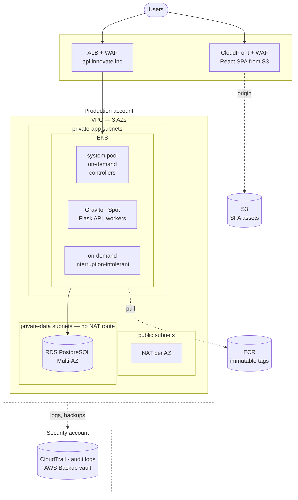

# Innovate Inc — infrastructure design

A design for a Python/Flask API, a React SPA and a PostgreSQL database, holding sensitive user data,
serving a few hundred users a day today and possibly millions later, delivered continuously, on
managed Kubernetes.

---

## The tension this design resolves

Two constraints in the brief pull in opposite directions:

| Constraint | What it argues for |
| --- | --- |
| **A few hundred users a day** | Almost everything can be small. One cluster, one database, few moving parts |
| **Sensitive user data** | Account isolation, encryption, audit, backups that have been restored |

Most designs resolve this by ignoring the first constraint and building for the second — a
five-account organisation, multi-region, service mesh, a platform team's worth of tooling for an
application that could run on one node.

**This design spends early on data protection and identity, and late on scale.** Isolation and
encryption are cheap and expensive to retrofit. Capacity is expensive and trivial to add. Every
component that is not needed on day one is listed with **the trigger that makes it necessary**,
so growth is a decision rather than a surprise.

The recurring question in each section is not *"what does a mature platform look like"* — it is
**"what is the smallest thing that is not wrong, and what changes it?"**

---

## High-level architecture

The SPA never touches the cluster. It is static content behind a CDN, which is cheaper, faster and
removes an entire class of problem. Only the API runs on Kubernetes; only the database is stateful;
everything else is replaceable.

---

## How to read this

| Document | Covers |
| --- | --- |
| [01-cloud-environment.md](01-cloud-environment.md) | AWS account structure — the minimum sensible start, and the trigger for each account added after it |
| [02-network.md](02-network.md) | VPC layout, subnet tiers, ingress and egress |
| [03-security.md](03-security.md) | Identity, secrets, encryption, the controls sensitive data actually requires |
| [04-kubernetes.md](04-kubernetes.md) | Why EKS, cluster design, node strategy, autoscaling, resource allocation |
| [05-delivery.md](05-delivery.md) | Container build, registry, and continuous delivery |
| [06-database.md](06-database.md) | PostgreSQL, high availability, backups, disaster recovery |

Each document ends with **what would change at scale**, and what triggers the change.

---

## The shape of the answer, in one table

For readers who want the conclusions before the reasoning:

| Area | Day one | Trigger to change |
| --- | --- | --- |
| Accounts | 3 — management, production, non-production | First compliance conversation → security/log-archive account |
| Region | Single, 3 AZs | A stated availability or data-residency requirement |
| Kubernetes | One EKS cluster, one namespace per environment | Provable tenant isolation → separate cluster or account |
| Nodes | Small on-demand system pool + Graviton Spot | Interruption-intolerant workloads → an on-demand pool |
| Database | RDS PostgreSQL Multi-AZ | Read scaling or sub-minute failover → Aurora |
| Delivery | GitHub Actions → ECR by digest → Argo CD | Traffic that justifies canaries → progressive delivery |
| SPA | S3 + CloudFront | — |
| Secrets | Secrets Manager via External Secrets Operator | — |

Nothing in the "day one" column is a placeholder to be replaced. Each is the correct answer at
current scale, and each has a documented path forward.

---

## What this design deliberately does not include

Stated so that absence reads as a decision rather than an oversight.

| Not included | Why not |
| --- | --- |
| **Multi-region** | Buys resilience, not savings, and the cost is paid daily. Out of scope until an availability requirement exists that Multi-AZ cannot meet |
| **Service mesh** | Adds an operational surface a small team pays for every day. Revisit when service-to-service authorisation or fine-grained traffic control becomes a real requirement, not before |
| **Self-managed PostgreSQL on Kubernetes** | Managed data services stay outside the cluster. Running a database on autoscaled Spot capacity is the fastest way to lose data |
| **A platform/internal developer portal** | Correct at fifty engineers, absurd at five |
| **Multi-tenancy inside one cluster** | Namespaces are environment isolation, not tenant isolation. If a customer ever requires provable isolation, the honest answer is a separate cluster or account |
